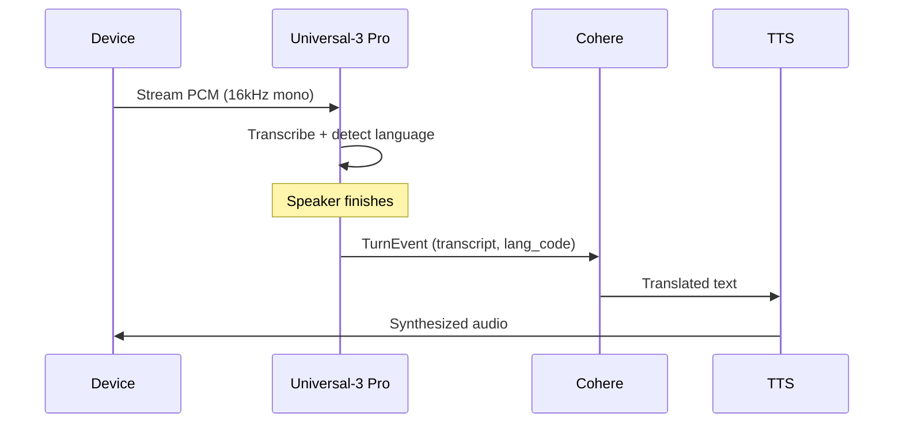
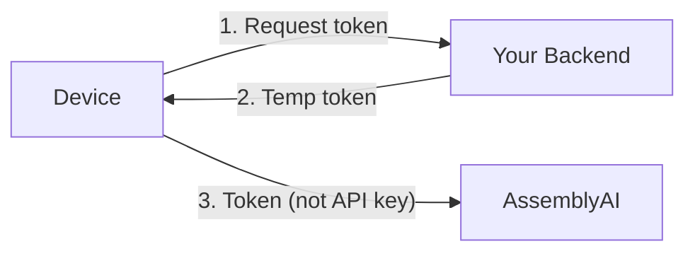
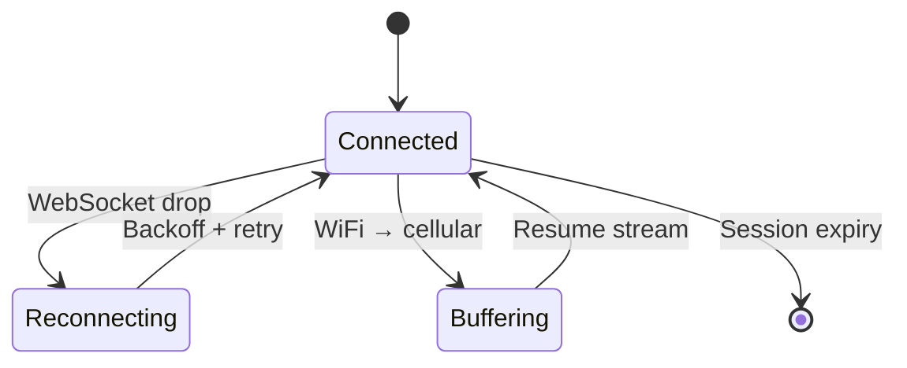

# iTranslate Use Case — Technical Architecture

## Executive Summary

iTranslate's handheld translation device requires accurate, low-latency STT for bilingual conversations under strict edge constraints. This document describes the **edge-to-cloud architecture** we recommend, the rationale for selecting AssemblyAI's **Universal-3 Pro** streaming model, and how it connects to the downstream translation pipeline.

---

## 1. Architecture Overview

### System Design

The design separates responsibilities between the **edge device** and a **cloud orchestration layer**. The device has no GPU and limited compute; all ASR, translation, and TTS synthesis run in the cloud. The device is a thin client: capture audio, stream it, play back results.

```
┌──────────────────────────────────────────────────────────────────┐
│  iTranslate Hardware Device (Edge)                               │
│  ┌──────────┐    ┌──────────┐    ┌──────────┐    ┌──────────┐  │
│  │ Mic      │───▶│ PCM      │───▶│ WiFi/    │───▶│ Speaker  │  │
│  │ (16kHz)  │    │ Encoder  │    │ Cellular │    │ (TTS out)│  │
│  └──────────┘    └──────────┘    └──────────┘    └──────────┘  │
└──────────────────────┬───────────────────▲──────────────────────┘
                       │                   │
              Raw PCM  │  WebSocket        │  Translated text
              audio    │  (wss://)         │  + TTS audio
                       ▼                   │
┌──────────────────────────────────────────┴──────────────────────┐
│  Cloud Orchestration Engine                                     │
│                                                                 │
│  ┌─────────────────┐   ┌─────────────────┐   ┌──────────────┐  │
│  │ AssemblyAI      │──▶│ LLM Gateway     │──▶│ TTS Engine   │  │
│  │ Universal-3 Pro │   │ (Cohere Command)│   │ (Cloud TTS)  │  │
│  │ Streaming STT   │   │                 │   │              │  │
│  └─────────────────┘   └─────────────────┘   └──────────────┘  │
└─────────────────────────────────────────────────────────────────┘
```

### Design Decisions

| Decision | Rationale |
|----------|-----------|
| **Cloud-based STT** | Device has insufficient compute for on-device inference; WebSocket streaming is the only viable path. |
| **PCM at 16kHz** | Matches Universal-3 Pro's preferred input; avoids transcoding and keeps latency low. |
| **Turn-based downstream trigger** | STT turn detection drives when to call the LLM and TTS, avoiding custom silence heuristics. |
| **Bandwidth** | ~32 KB/s (16 kHz × 2 bytes/sample) fits well within WiFi and cellular limits. |

### Data Flow



1. Device captures 16 kHz mono PCM and streams it over WebSocket to AssemblyAI.
2. Universal-3 Pro transcribes in real time, detects language, and emits **turn events** when the speaker finishes.
3. On each turn, the orchestration layer receives transcript + language code and calls the LLM for translation.
4. Translated text is synthesized by the TTS engine and streamed back to the device speaker.

---

## 2. Model Selection: Universal-3 Pro

Universal-3 Pro (`u3-rt-pro`) was chosen because it satisfies the core architectural requirements in one model:

- **Code-switching** — Handles EN/ES/FR/DE/IT/PT without configuration. Essential for a translation device in mixed-language settings.
- **Low latency** — Sub-300ms STT latency, which fits within a sub-second end-to-end target for the full pipeline.
- **Turn detection** — Provides a natural trigger point for downstream translation; no ad-hoc silence detection on the device.
- **Domain vocabulary** — `keyterms_prompt` supports domain-specific terms (e.g., medical, brands) without custom training.

We evaluated against language-specific or older streaming models; Universal-3 Pro is required for the bilingual, code-switching use case. English and Spanish accuracies (94%+) are sufficient for production.

**Reference:** [Universal-3 Pro Streaming](https://www.assemblyai.com/docs/streaming/universal-3-pro)

---

## 3. Integration Contract

The critical integration point is the **turn event**. When Universal-3 Pro fires `end_of_turn`, the orchestration layer has a complete utterance and language metadata and can safely invoke the LLM. The device does not need to detect silence or segment audio; the model handles that.

```
┌─────────────────┐   TurnEvent   ┌─────────────────┐   translated   ┌──────────────┐
│ Universal-3 Pro │──────────────▶│ LLM Gateway     │───────────────▶│ TTS Engine   │
│ (AssemblyAI)    │  transcript   │ (Cohere)        │    text        │              │
│                 │  lang_code    │                 │                │              │
└─────────────────┘               └─────────────────┘                └──────────────┘
```

The streaming client wires the turn callback and configures language detection and optional keyterms:

```python
# Assembly point: on_turn fires when the speaker stops
def on_turn(event: TurnEvent):
    if event.end_of_turn:
        transcript = event.transcript
        lang = getattr(event, "language_code", "en")
        translated = llm_gateway.translate(transcript, target_from=lang)
        tts_engine.speak(translated)

client.on(StreamingEvents.Turn, on_turn)
client.connect(StreamingParameters(
    speech_model="u3-rt-pro",
    language_detection=True,
    keyterms_prompt=["EpiPen", "metformin", "insulin glargine"],  # domain vocab
    sample_rate=16000,
))
```

**Reference:** [Streaming tutorial](https://www.assemblyai.com/docs/getting-started/transcribe-streaming-audio-from-a-microphone/python)

---

## 4. Operational Architecture

### Latency Budget

| Stage | Latency |
|-------|---------|
| Capture + network | ~50 ms |
| AssemblyAI STT | ~300 ms |
| LLM translation | ~100–200 ms |
| TTS synthesis | ~200–500 ms |
| **End-to-end** | **~650–1050 ms** |

Sub-second latency is acceptable for handheld translation devices and aligns with products like Pocketalk.

### Security



- Use **temporary auth tokens** issued by your backend for device sessions; do not ship API keys on the device. See [Temporary auth tokens](https://www.assemblyai.com/docs/streaming#authenticate-with-a-temporary-token).

### Resilience



- **WebSocket reconnects:** Exponential backoff with local audio buffering during outages.
- **Network handoff (WiFi → cellular):** Buffer mic input during the transition, then resume streaming.
- **Session lifetime:** Respect `expires_at` from the Begin event; reconnect before expiry.

### Regional Deployment

- Use `streaming.eu.assemblyai.com` for EU users to reduce latency and support GDPR needs.

---

## 5. Demo

A Streamlit demo simulates the device and cloud pipeline:

| Component | Role |
|-----------|------|
| `itranslate_demo/app/app.py` | Simulated device: mic capture and UI, no ML models. Includes a Keyterms Prompting toggle. |
| `itranslate_demo/app/assemblyai_service.py` | Cloud orchestration: streams to Universal-3 Pro, parses language, calls Cohere. |

**Run locally** (requires microphone):

```bash
cd itranslate_demo/app
export ASSEMBLYAI_API_KEY="your_key"
export COHERE_API_KEY="your_key"
streamlit run app.py
```
