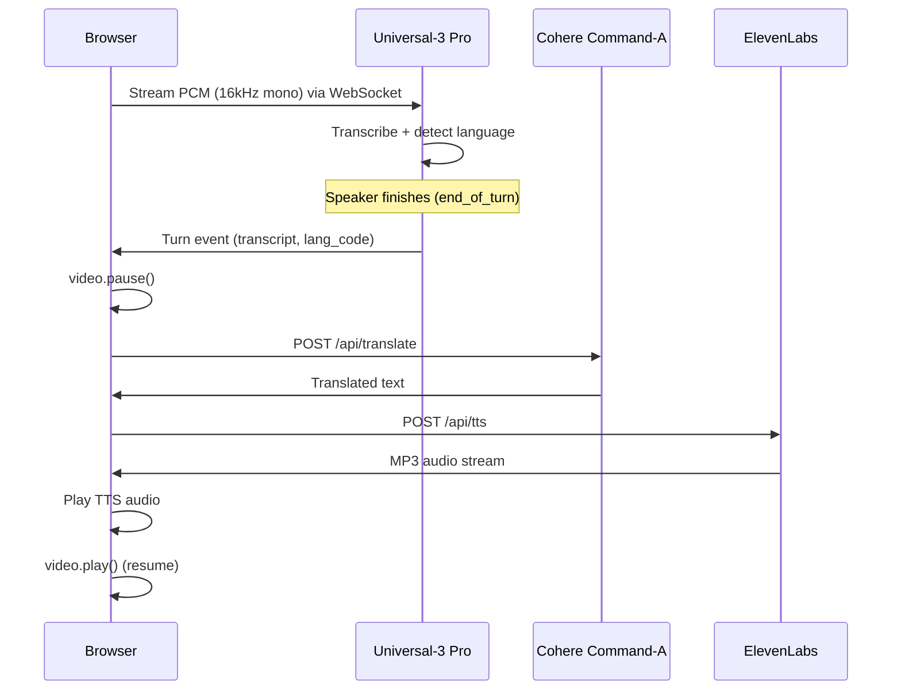
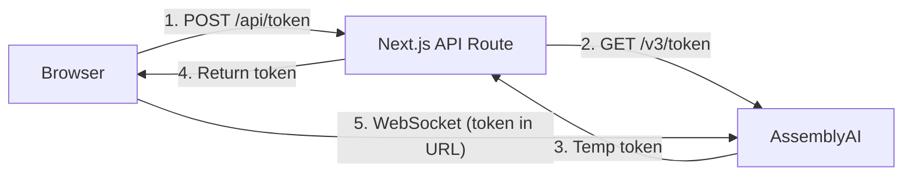
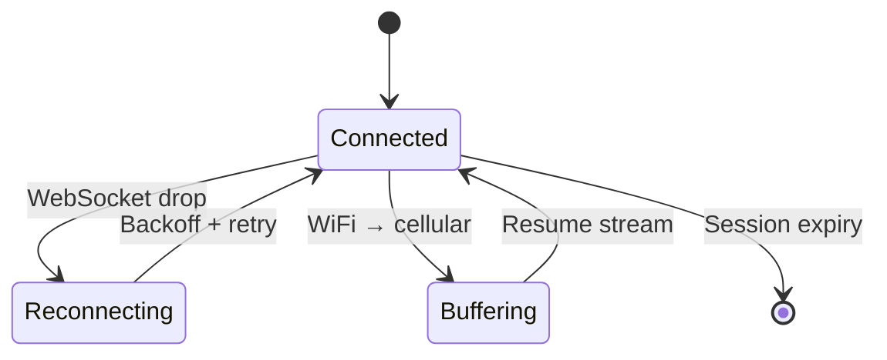

# iTranslate Use Case — Technical Architecture

## Executive Summary

iTranslate's handheld translation device requires accurate, low-latency STT for bilingual conversations under strict edge constraints. This document describes the **edge-to-cloud architecture** we recommend, the rationale for selecting AssemblyAI's **Universal-3 Pro** streaming model, and how the full pipeline — STT → LLM Translation → TTS — delivers real-time video dubbing.

---

## 1. Architecture Overview

### System Design

The design separates responsibilities between the **edge client** (a Next.js browser app) and a **cloud orchestration layer**. The device/browser has no GPU and limited compute; all ASR, translation, and TTS synthesis run in the cloud. The client is thin: capture audio, stream it, play back results.

```
┌──────────────────── BROWSER CLIENT ─────────────────────┐
│                                                          │
│  <video> ──► Web Audio API ──► PCM chunks (16kHz s16le)  │
│    │              │                    │                  │
│    │         (video audio              │                  │
│    │          plays through       WebSocket               │
│    │          speakers)                │                  │
│    │                                   ▼                  │
│    │◄── video.pause() ◄── end_of_turn fires              │
│    │                         │                            │
│    │  ┌──────────────────────┤                            │
│    │  │ 1. POST /api/translate → Cohere                  │
│    │  │ 2. POST /api/tts → ElevenLabs                    │
│    │  │ 3. Play TTS audio                                │
│    │  └──────────────────────┤                            │
│    │                         │                            │
│    │◄── video.play()  ◄── TTS finishes                   │
└──────────────────────────────────────────────────────────┘
                       │ WebSocket audio
                       ▼
┌──────────────────────────────────────────────────────────┐
│  Cloud Services                                          │
│                                                          │
│  ┌─────────────────┐   ┌─────────────────┐   ┌────────┐ │
│  │ AssemblyAI      │──▶│ Cohere          │──▶│Eleven  │ │
│  │ Universal-3 Pro │   │ Command-A       │   │Labs    │ │
│  │ Streaming STT   │   │ (v2/chat)       │   │TTS     │ │
│  └─────────────────┘   └─────────────────┘   └────────┘ │
└──────────────────────────────────────────────────────────┘
```

### Design Decisions

| Decision | Rationale |
|----------|-----------|
| **Cloud-based STT** | Device has insufficient compute for on-device inference; WebSocket streaming is the only viable path. |
| **PCM at 16kHz** | Matches Universal-3 Pro's preferred input; avoids transcoding and keeps latency low. |
| **Turn-based downstream trigger** | STT turn detection drives when to call the LLM and TTS, avoiding custom silence heuristics. |
| **Video pause/resume cycle** | Pausing at natural speech boundaries ensures the translation is heard cleanly without audio overlap. |
| **Buffered 100ms audio chunks** | AssemblyAI requires chunks between 50–1000ms; we buffer downsampled PCM into 3200-byte (100ms) frames before sending. |
| **Bandwidth** | ~32 KB/s (16 kHz × 2 bytes/sample) fits well within WiFi and cellular limits. |

### Data Flow



1. Browser captures video audio via `createMediaElementSource()`, downsamples to 16kHz PCM, and streams over WebSocket to AssemblyAI.
2. Universal-3 Pro transcribes in real time, detects language, and emits **turn events** when the speaker finishes.
3. On each turn, the browser pauses the video, calls Cohere for translation, and ElevenLabs for TTS.
4. When TTS playback finishes, the video resumes automatically.

---

## 2. Model Selection: Universal-3 Pro

Universal-3 Pro (`u3-rt-pro`) was chosen because it satisfies the core architectural requirements in one model:

- **Code-switching** — Handles EN/ES/FR/DE/IT/PT without configuration. Essential for a translation device in mixed-language settings.
- **Low latency** — Sub-300ms STT latency, which fits within a sub-second end-to-end target for the full pipeline.
- **Turn detection** — Provides a natural trigger point for downstream translation; no ad-hoc silence detection on the device.
- **Domain vocabulary** — `keyterms_prompt` supports domain-specific terms (e.g., medical, brands) without custom training.
- **v3 WebSocket protocol** — Configuration via URL query params (`speech_model`, `sample_rate`); temporary auth tokens for browser-side connections.

We evaluated against language-specific or older streaming models; Universal-3 Pro is required for the bilingual, code-switching use case. English and Spanish accuracies (94%+) are sufficient for production.

**Reference:** [Universal-3 Pro Streaming](https://www.assemblyai.com/docs/streaming/universal-3-pro)

---

## 3. Integration Contract

The critical integration point is the **turn event**. When Universal-3 Pro fires `end_of_turn`, the orchestration layer has a complete utterance and language metadata and can safely invoke the LLM. The device does not need to detect silence or segment audio; the model handles that.

```
┌─────────────────┐   TurnEvent   ┌─────────────────┐   translated   ┌──────────────┐
│ Universal-3 Pro │──────────────▶│ LLM Gateway     │───────────────▶│ TTS Engine   │
│ (AssemblyAI)    │  transcript   │ (Cohere v2/chat)│    text        │ (ElevenLabs) │
│                 │  lang_code    │                 │                │              │
└─────────────────┘               └─────────────────┘                └──────────────┘
```

The WebSocket connection uses URL query params for configuration and sends binary PCM frames:

```javascript
// Browser: connect with config in URL params
const ws = new WebSocket(
  `wss://streaming.assemblyai.com/v3/ws?token=${token}&sample_rate=16000&speech_model=u3-rt-pro`
);

// On each turn event:
ws.onmessage = (event) => {
  const msg = JSON.parse(event.data);
  if (msg.type === 'Turn' && msg.end_of_turn) {
    video.pause();
    const translation = await translate(msg.transcript, msg.language_code);
    await speak(translation);      // ElevenLabs TTS
    video.play();                   // Resume
  }
};
```

**Reference:** [Streaming tutorial](https://www.assemblyai.com/docs/getting-started/transcribe-streaming-audio-from-a-microphone/python)

---

## 4. Operational Architecture

### Latency Budget

| Stage | Latency |
|-------|---------|
| Video audio capture + network | ~50 ms |
| AssemblyAI STT | ~300 ms |
| Cohere LLM translation | ~100–200 ms |
| ElevenLabs TTS synthesis | ~200–500 ms |
| **End-to-end** | **~650–1050 ms** |

Sub-second latency is acceptable for handheld translation devices and aligns with products like Pocketalk.

### Security



- **Temporary auth tokens** are generated server-side via Next.js API routes; API keys never reach the browser.
- Cohere and ElevenLabs calls are proxied through server-side API routes (`/api/translate`, `/api/tts`).

### Resilience



- **WebSocket reconnects:** Exponential backoff with local audio buffering during outages.
- **Network handoff (WiFi → cellular):** Buffer mic input during the transition, then resume streaming.
- **Session lifetime:** Respect `expires_at` from the Begin event; reconnect before expiry.

### Regional Deployment

- Use `streaming.eu.assemblyai.com` for EU users to reduce latency and support GDPR needs.

---

## 5. Demo

A **Next.js web application** demonstrates the full pipeline as a real-time video dubbing system.

### File Architecture

| Component | Role |
|-----------|------|
| `web/app/page.js` | Video dubbing UI: URL input, video player, Start/Stop Dubbing, transcript panel, analytics |
| `web/lib/useVideoDubbing.js` | Core orchestration hook: video audio → AssemblyAI → pause → Cohere → ElevenLabs → resume |
| `web/app/api/token/route.js` | Generates temporary AssemblyAI auth tokens (keys stay server-side) |
| `web/app/api/translate/route.js` | LLM Gateway: Cohere `command-a-03-2025` via v2/chat API |
| `web/app/api/tts/route.js` | ElevenLabs TTS proxy (returns MP3 audio stream) |
| `web/app/api/video/download/route.js` | Downloads YouTube videos via `yt-dlp` for local playback |
| `web/lib/constants.js` | Domain-specific keyterms for STT boosting |

### Run Locally

```bash
cd itranslate_demo/web
cp .env.example .env.local  # Add your API keys
npm install
npm run dev
# Open http://localhost:3000
```

**Required environment variables:**
```
ASSEMBLYAI_API_KEY=your_key
COHERE_API_KEY=your_key
ELEVENLABS_API_KEY=your_key
```

**System dependency:** `yt-dlp` (for YouTube video downloads)
```bash
brew install yt-dlp   # macOS
```
